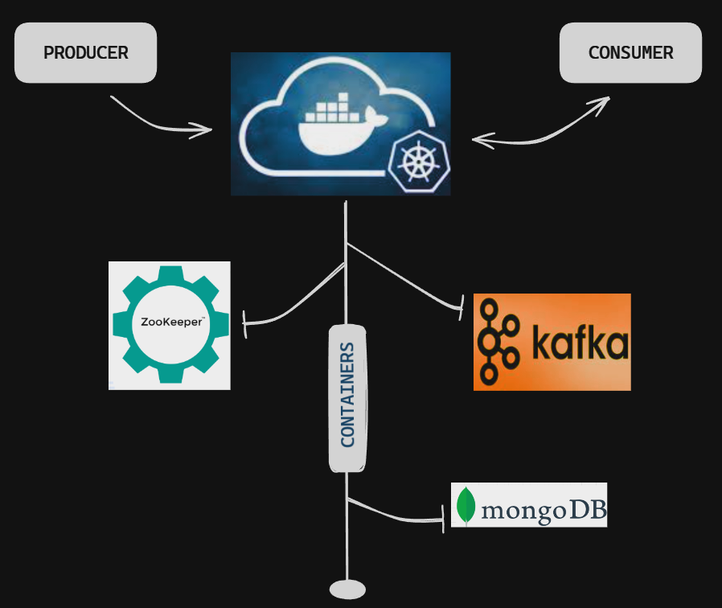

<h3>This is an example of a Python application for scraping a log.txt, considering that this log is received through a messaging server, such as Kafka. 
The APIs are locally stored in Docker containers, in a NoSQL database (MongoDB). Welcome!</h3>

>The application receives an extensive log containing timestamp information and player movements in an FPS game (such as CS, Vava, CoD, The Arena 3).
>Information about each round played in the game lobby is recorded, and the <b>Python application</p> extracts important information for both player activity 
logging and future analysis of player behavior in the room.

<h2>How it works: </h2>
<h3><i> Kafka </i> || <i> Docker </i> || <i> MongoDB </i></h3>

<strong>Zookeeper</strong> and <strong>Kafka broker</strong> are separated into containers for event management triggered by a producer, while one consumer collects the messages. 
In this repository, in the file sendLog.py, an instance of the producer is created to send the log file to the server on a port specified in <strong>docker-compose</strong>, 
while the main.py file creates an instance of the consumer that collects information recorded after its creation.
After obtaining the information, scraping is performed, and the data is stored in documents in <strong>MongoDB</strong>.

<div align="center">
  
 </div>


>In the 'modules' folder, there are classes responsible for scraping, and in the controllers folder, there are classes responsible for handling the Kafka-Confluent API and MongoDB. In the tests folder, there are unit tests for the classes in 'module' using the Pytest framework. A summary of the unit tests is available in .html files.

<h2>How to use: </h2>

1. Clone the repository.
<br>

2. Install the packages in the requirements.txt using:
```bash
pip install -r requirements.txt
```
<br>

3. Run docker-compose. You should have 3 active containers.
```bash
docker-compose -d up
```
<br>

4. Enter the broker and configure the partitions and topic to connect with the consumer. The broker name in the .yml file is "only1Brokerv2".
```bash
docker exec -it "broker_name" bash
docker-topics --create --bootstrap-server "broker_url" --replication-factor 1 --partition 1 --topic "topic_name"
```

<i>As an example, both the replication factor and partitions were configured to 1. It is recommended to use more than 1 broker, with replication and partitions above 2.</i>

<br>

5. If you want to check if the topic was created:
```bash
kafka-topics --list --bootstrap-server localhost:"broker_url"
```

The consumer was instantiated in the main.ipynb file, making it more didactic to observe each step of the scraping. 
Remember to instantiate the consumer before executing the producer in step 5.

<br>

6. Open your terminal and run the 'kafka-docker/tests_in_project/sendLog.py' file.
```bash
python sendLog.py localhost:19092 "your-topic-here"
```
<br>

7. Go back to the main.ipynb file and continue running each cell.


<video width="640" height="360" controls>
        <source src="media/video.mp4" type="video/mp4">
        Seu navegador não suporta o elemento de vídeo.
    </video>
